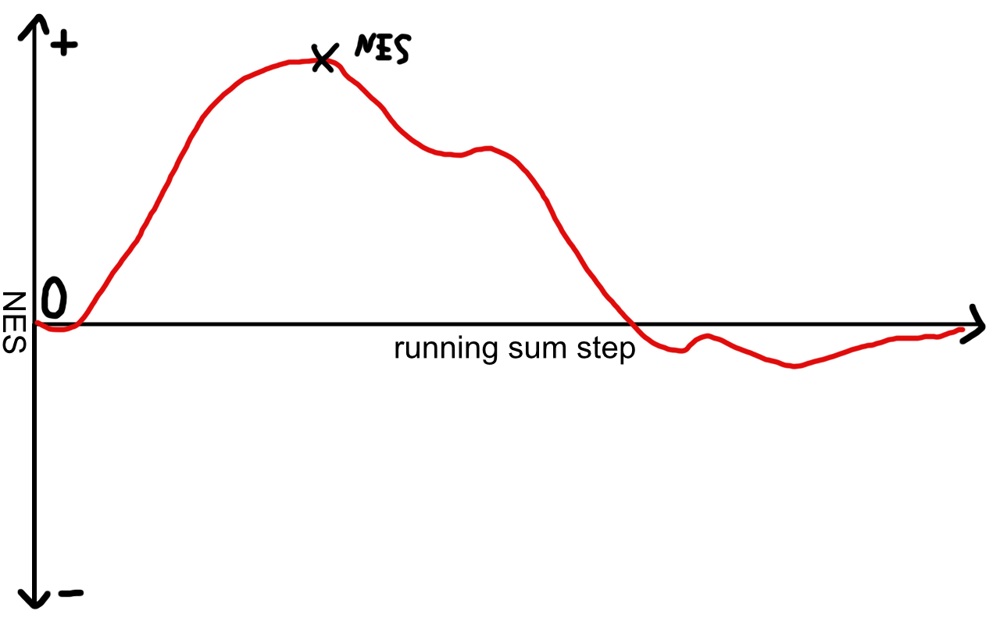
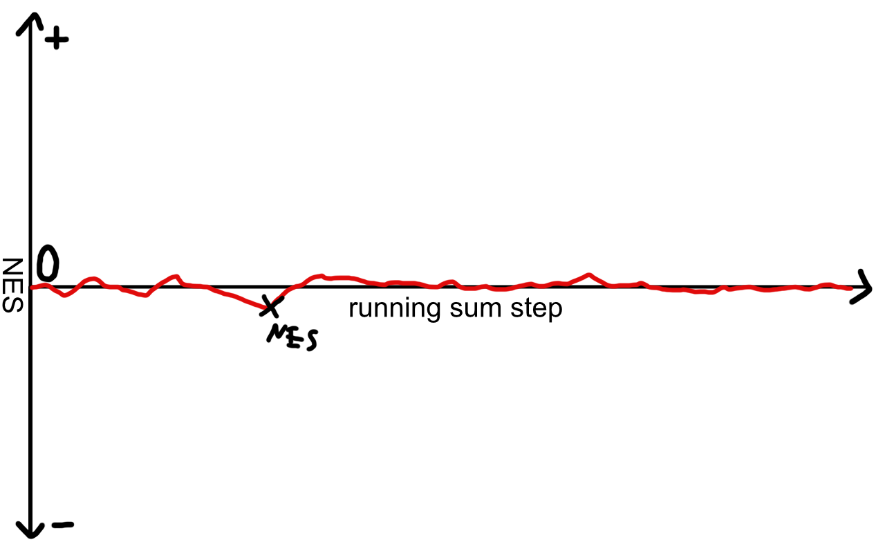

# Introduction

Welcome to the fifth part of this RNA-seq analysis series! In previous parts we have covered how to statistically test for differentially expressed genes with DESeq2. But how can we translate a list of genes to biological insights? To do so, we can make use of gene set enrichment analysis, which attempts to identify sets of genes that are co-regulated within a biological processes, for example fatty acid synthesis or innate immune system activation.

We have already prepared our data in a previous part of this series. The gist of this preliminary work is contained in the folded code chunk below.

```{r}
#| code-fold: true
#| label: load-data
#| cache: true

#load necessary libraries
library(here) # for file paths
library(DESeq2) # for RNA-seq analysis
library(org.Hs.eg.db)
library(AnnotationDbi) # for gene annotation

# Downloading the count matrix
url <- "https://www.ncbi.nlm.nih.gov/geo/download/?acc=GSE123658&format=file&file=GSE123658%5Fread%5Fcounts%2Egene%5Flevel%2Etxt%2Egz"

dest <- here("data", "rnaseq", "GSE123658_counts.tsv.gz")

download.file(url, destfile = dest)

# Loading the count matrix
counts <- read.delim(dest, row.names = 1)
# Remove "X" prefix from column names
colnames(counts) <- sub("^X", "", colnames(counts))

# require genes to have a count of 10 or more in at least 5 samples to be included in the analysis
keep <- rowSums(counts >= 10) >= 5
counts <- counts[keep, ]

# Loading the metadata
library(GEOquery) # for loading data from GEO

gse <- getGEO("GSE123658", GSEMatrix = TRUE)

# Combine metadata from both platforms into a single data frame
eset_nextseq <- gse[["GSE123658-GPL18573_series_matrix.txt.gz"]]

eset_hiseq <- gse[["GSE123658-GPL20301_series_matrix.txt.gz"]]

meta <- rbind(
    pData(eset_nextseq),
    pData(eset_hiseq)
)

meta$sample_id <- sub(".*ID:", "", meta$title)
meta$sample_id <- trimws(meta$sample_id)

# set row names of metadata to sample_id
rownames(meta) <- meta$sample_id

# define factor condition based on the title column
meta$condition <- ifelse(
    grepl("healthy", meta$title, ignore.case = TRUE),
    "control",
    "disease"
)

meta$condition <- factor(meta$condition, levels = c("control", "disease"))

# define factor platform based on the platform_id column
meta$platform <- ifelse(
    grepl("GPL18573", meta$platform_id),
    "NextSeq",
    "HiSeq"
)

meta$platform <- factor(meta$platform, levels = c("NextSeq", "HiSeq"))

# define age as numeric variable
meta$age <- as.numeric(meta$`age:ch1`)

# define sex as a factor variable
meta$sex <- factor(meta$`Sex:ch1`, levels = c("M", "F"))

# Aligning the count matrix and metadata
meta <- meta[match(colnames(counts), rownames(meta)), ]

# Create a mapping between Ensembl gene IDs and gene symbols
genes <- rownames(counts)

gene_symbols <- mapIds(
    org.Hs.eg.db,
    keys = genes,
    keytype = "ENSEMBL",
    column = "SYMBOL",
    multiVals = "first" # should multiple mappings occur
)

# Create DESeqDataSet object
dds <- DESeqDataSetFromMatrix(
    countData = counts,
    colData = meta,
    design = ~ platform + condition
)

# Add gene symbols as row data
rowData(dds)$symbol <- gene_symbols[rownames(dds)]

# cleanup missing gene symbols (NA) and replace them with the Ensembl ID again
symbols <- rowData(dds)$symbol

# Replace NA with Ensembl IDs
symbols[is.na(symbols)] <- rownames(dds)

# ensure uniqueness
symbols <- make.unique(symbols)

rowData(dds)$symbol <- symbols

dds <- estimateSizeFactors(dds)

# Perform variance stabilizing transformation to reduce mean-variance dependence
vsd <- vst(dds, blind = TRUE)
mat <- assay(vsd)

# run DESeq
dds <- DESeq(dds)

# perform effect-size-aware hypothesis testing
res_thresh <- results(
        dds,
        contrast = c("condition", "disease", "control"),
        lfcThreshold = 0.2,
        altHypothesis = "greaterAbs")

# convert ensembl IDs to gene symbols where possible
symbols <- rowData(dds)$symbol
names(symbols) <- rownames(dds)

# because results inherit the row order from the dds, we can just set the symbols
res_thresh$symbol <- symbols[rownames(res_thresh)]
```

# Gene Set Enrichment Analysis
Gene set enrichment analysis (GSEA) is a method that takes all genes of our analysis into account. The log2FoldChange between conditions and statistical evidence (p-value) is used to arrive at a shorter list of pathways for hypothesis generation.

The input for GSEA is a ranked list of genes. How we score our genes depends on our question, but in our case we want to know which pathways are upregulated or downregulated between two experimental conditions. We will use the stat value from our DESeq results for ranking, as it represents the magnitude of effects and their consistency across samples (statistical evidence via the standard error).\
We could also rank our genes based on correlation with another data type we have recorded. For each gene, we could perform a Spearman correlation between an individual's expression in that gene and their interferon-gamma levels. This is a straightforward way to connect results from different experiments.

# Gene ontology term dotplot
If we don't want to perform enrichment with a complete ranked list of our genes, we can also just take the significantly differentially expressed genes and perform an over-representation analysis. One downside of this will always be that we define arbitrary thresholds and might miss important pathways. However, this way we can get a quick overview whenever a set of genes pops up that needs to be investigated further.

We have seen in part 4 that only a single gene "survived" our p-value adjustment. Combine that with the evidence from the PCA plot in part 2 and we get the picture that our type I diabetes cohort is made up of a heterogeneous set of samples (other possible reasons are also discussed in part 2).
To finish the tutorial on the standard analysis, I will show you how to perform the enrichment using the raw p-value. Make sure to use the adjusted p-value wherever possible to tame your false positive discoveries.

```{r}
#| code-fold: true
#| label: dotplot
#| cache: true
#| message: false
library(clusterProfiler)
library(enrichplot)
# perform over-representation analysis with clusterProfiler
enrich_res <- enrichGO(
    gene = res_thresh$symbol[res_thresh$pvalue < 0.1], #very liberal threshold for demonstration purposes, use padj < 0.05 for reliable results
    OrgDb = org.Hs.eg.db,
    keyType = "SYMBOL",
    ont = "BP", # biological process
    pAdjustMethod = "BH",
    qvalueCutoff = 0.05
)
# visualize results with a dotplot
dotplot(enrich_res, showCategory = 20) + ggtitle("Over-representation analysis of significantly differentially expressed genes")
```

# Gene set enrichment analysis with fgsea
The fgsea package allows us to perform gene set enrichment analysis with a ranked list of genes. Compared to over-representation analysis, this method takes all genes into account and does not require an arbitrary threshold for significance.
We will use the hallmark gene sets from the MSigDB database, which are a collection of 50 gene sets that represent well-defined biological states or processes. We will also use the KEGG insulin signaling gene set to illustrate how the choice of gene set and scientific context can influence our results. Both of these files can be downloaded from the MSigDB database and are available in the data folder of this blog repository on GitHub.

```{r}
#| code-fold: true
#| label: fgsea
#| cache: true
#| message: false
#| warning: false
library(fgsea)
library(here)
# load gene sets from MSigDB
# download the gene sets from MSigDB and save them as .gmt files
# load the gene sets
gene_sets_hallmark <- gmtPathways(here("data", "rnaseq", "msigdb", "h.all.v2026.1.Hs.symbols.gmt"))
# prepare ranked list of genes
ranks <- res_thresh$stat
names(ranks) <- res_thresh$symbol
# perform gene set enrichment analysis with fgsea
fgsea_res_hallmark <- fgsea(
    pathways = gene_sets_hallmark,
    stats = ranks,
    minSize = 15,
    maxSize = 500,
)
```

:::{.callout-note collapse="true"}
## 🧠 How does gene set enrichment analysis work?
Gene set enrichment analysis scores each of our gene sets with a normalized enrichment score and an adjusted p-value for statistical evidence. The enrichment score is computed by taking the gene set and walking down the ranked gene list from top to bottom. At each gene a running sum statistic is calculated and the overall normalized enrichment score for this set will increase or decrease. After the whole ranked list is passed, the global maximum or minimum of the sum statistic will define our normalized enrichment score.



If we encountered many genes from our set at the top of the list, we will assign this pathway a high positive NES.



If the genes of our set are scattered throughout the list, the score will briefly rise or fall without ever reaching a large absolute value. The statistical significance is calculated by trying out random permutations of the gene sets and estimating how likely the observed NES is, should the genes be randomly shuffled among the sets. 
:::

:::{.callout-note collapse="true"}
## 🧠 How to choose the right gene sets for my analysis?
The function of genes is often context dependent. For example, a gene that is involved in fatty acid synthesis in the liver might be involved in a completely different process in the brain. Therefore, it is important to choose gene sets that are relevant for your biological question and the tissue you are studying. The [MSigDB](https://www.gsea-msigdb.org/gsea/msigdb/) database provides a wide range of gene sets for different organisms and contexts, but there are also many other databases and resources available.
:::

# Visualization of normalized enrichment scores
My preferred way of visualizing the results of gene set enrichment analysis is a dotmatrix in which the normalized enrichment score (NES) is represented by the color of the dot and the size of the dot represents the significance of the enrichment.

```{r}
#| code-fold: true
#| label: fgsea-hallmark-plot
#| cache: true
#| message: false
#| warning: false
library(ggplot2)
# prepare data for plotting
fgsea_res_hallmark$pathway <- factor(fgsea_res_hallmark$pathway, levels = fgsea_res_hallmark$pathway[order(fgsea_res_hallmark$NES)])
# plot the results
ggplot(fgsea_res_hallmark, aes(x = pathway, y = NES, color = NES, size = -log10(padj))) +
    geom_point() +
    scale_color_gradient2(low = "blue", mid = "white", high = "red", midpoint = 0) +
    coord_flip() +
    theme_minimal() +
    theme(axis.text.x = element_text(angle = 90, vjust = 0.5, hjust=1)) +
    labs(title = "Gene Set Enrichment Analysis", x = "Pathway", y = "Normalized Enrichment Score (NES)", color = "NES", size = "-log10(adj p-value)")
```

# Conclusion
This wraps up a standard transcriptomics analysis! I wanted to show you an example that is closer to a real analysis, which showed perhaps the most common problem in transcriptomics: a heterogeneous disease cohort with low statistical evidence for differentially expressed genes. Should your samples have clustered neatly at the PCA stage in part 2, then you can find more differentially expressed genes and start forming biological hypotheses based on the gene set enrichment analysis.\
In our case, we could start to contemplate why exactly type I diabetes is such a heterogeneous disease. Maybe there are subgroups that could be explained by certain metadata variables we have not recorded yet, like medication. Maybe single cell approaches can provide a clearer picture.\
I was pleased to see that the authors of the paper from which I have gathered the data came to a similar conclusion [@valentim_transcriptomic_2025]. They decided to further investigate the subgroups using machine learning approaches. A future episode could explore this further, but for now I have some other interesting subjects I want to cover, stay tuned!

Cover Photo by <a href="https://unsplash.com/@googledeepmind?utm_source=unsplash&utm_medium=referral&utm_content=creditCopyText">Google DeepMind</a> on <a href="https://unsplash.com/photos/a-bunch-of-flowers-that-are-on-top-of-each-other-gHBJK2PnELQ?utm_source=unsplash&utm_medium=referral&utm_content=creditCopyText">Unsplash</a>
      
      